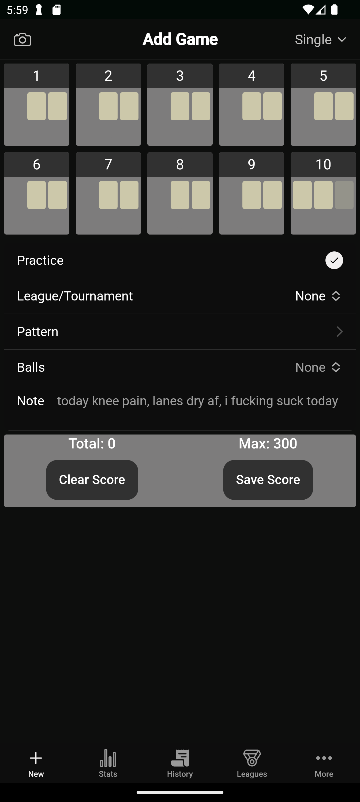
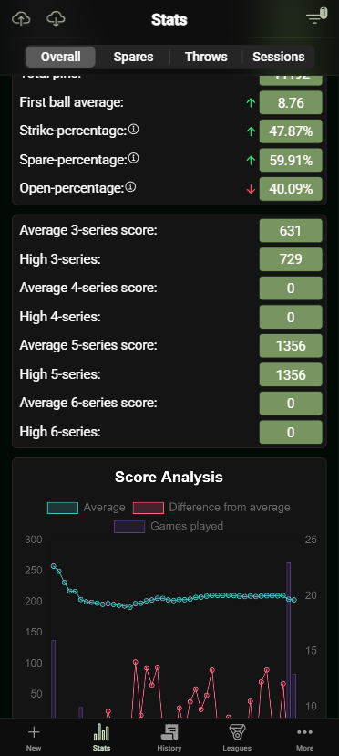
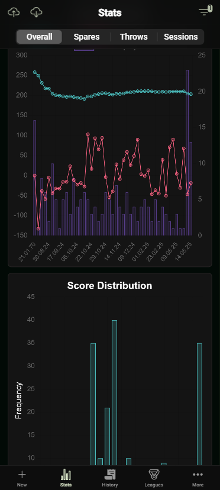
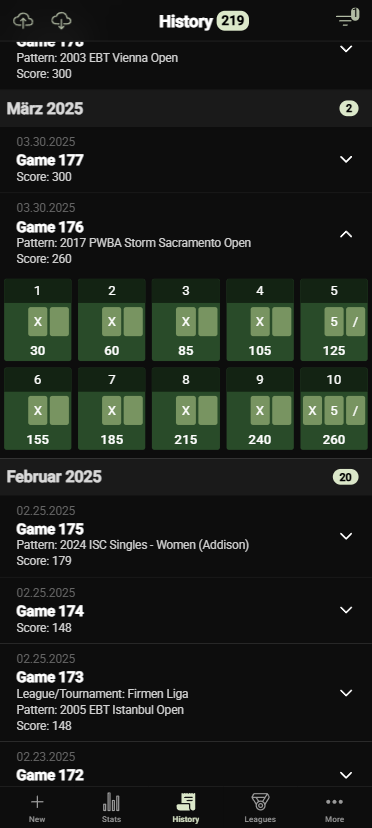
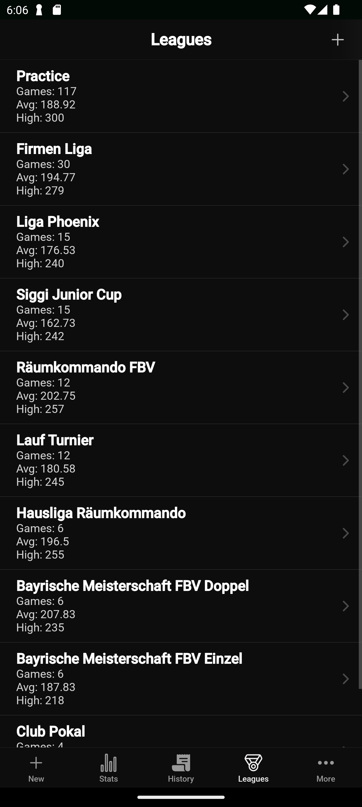
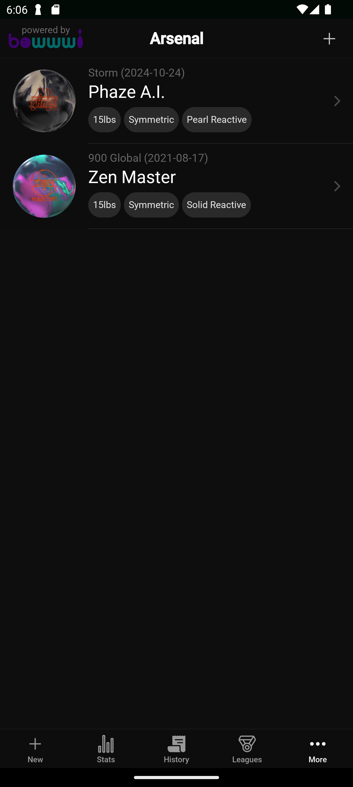
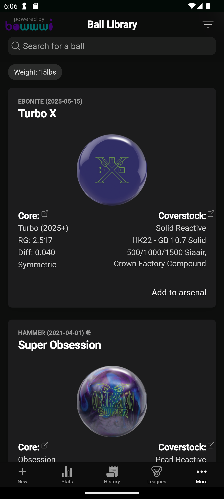
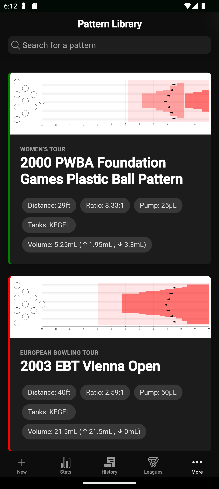
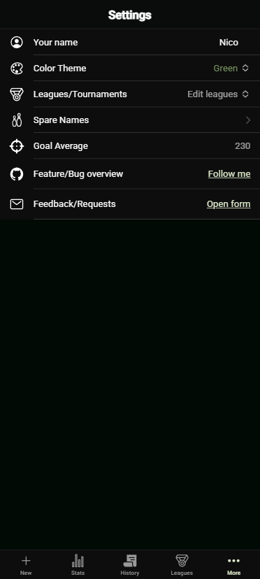

# Lightning Bowl - A comprehensive bowling tracker

Lightning Bowl is a free app designed for bowlers of all skill levels, from beginners to pros. It helps track your games and statistics with ease, offering a clean and intuitive interface across four main tabs.

## Disclaimer

This project is provided under a custom license. You are welcome to fork this repository for personal use. Please see the [LICENSE](LICENSE) file for full details.

## Features

### Add Games

On the "Add" page, you can effortlessly log your games. There’s even an option to upload images of your scoresheet, allowing automatic entry of your scores (currently compatible with West-Bowl’s scoring system).
You can select a league, pattern, ball and even a note to all your games. If you are playing a series there is the possibility to swap between single, 3-4-5-6 Series. It also supports detailed pin-data input with automatic split detection.



### View Statistics

The "Stats" page provides a comprehensive overview of your performance. Track key metrics like your average score, total strikes, spares, clean games, and more. You can also see which pin counts you miss most often. Additionally, a special section shows stats for the currently selected session.

 

### Game History

In the "History" section, you’ll find a detailed log of all your past games. Swipe right to share, swipe even further to edit, or swipe left to delete. You can also export your game history to a readable Excel file or import games using the same format.



### Leagues

Manage your leagues in the "Leagues" tab. You can add new leagues, view your performance within specific leagues, and see league-specific statistics. You can also hide leagues when longpressing the league.



### Arsenal

Keep track of your bowling balls in the "Arsenal" section, accessible via the "More" tab. Add details about each ball, such as name, brand, core, and coverstock.



### Ball Details

View and manage individual ball information. This includes specifics like core type, coverstock details, and factory finish, helping you understand your equipment better.



### Pattern Library

Explore different oil patterns in the "Pattern Library", accessible via the "More" tab. View details about various patterns, including their length, volume, and ratio, to better prepare for different lane conditions.



### Settings

The "Settings" page allows you to personalize your experience. Customize your username and choose from a range of color themes to suit your style. You can also look up spare names or find out how many games you need to reach a certain average.




## Contributing

Currently i don't want anybody to contribute yet. But i am free for suggestions and feature request.

## Feedback

If you have any feedback, please reach out to us at lightningbowlapp@gmail.com

## Run Locally

Clone the project

```bash
  git clone https://github.com/HappyKnuckles/bowling-stats.git
```

Go to the project directory

```bash
  cd bowling-stats
```

Install dependencies

```bash
  npm install
```

Start the server

```bash
  ionic serve
```
